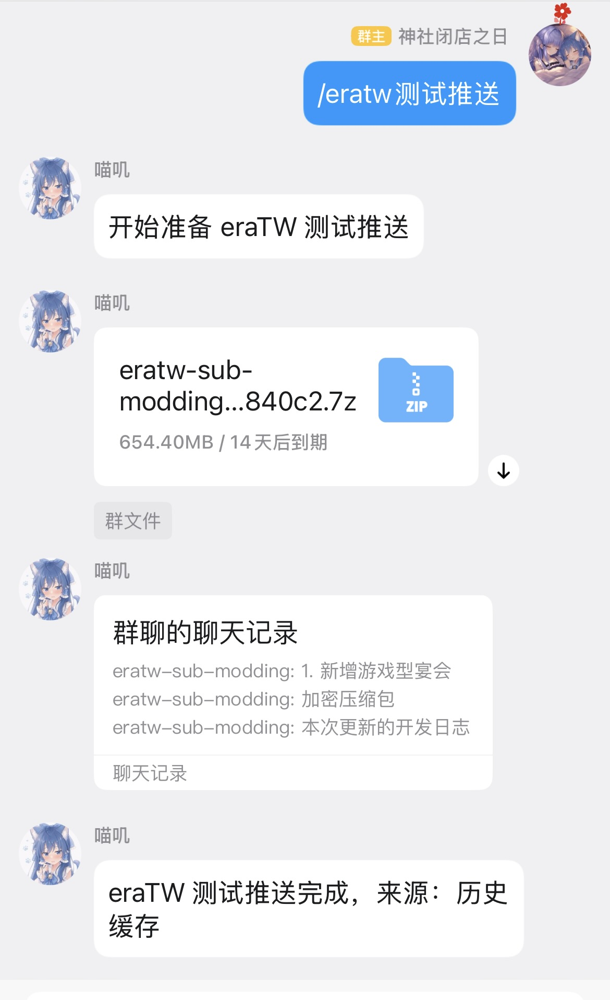
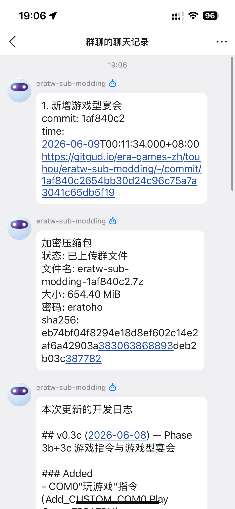

<div align="center">
  <a href="https://v2.nonebot.dev/store">
    
  </a>

## ✨ nonebot-plugin-eratw-mirror ✨

</div>

GitGud eraTW 魔改仓库更新搬运插件。

插件会按定时计划检查 GitGud 项目 `era-games-zh/touhou/eratw-sub-modding` 的主仓库：

1. 比较当前 commit 和本地保存的 `last_success_sha`。
2. 用 GitLab compare API 补齐两次推送间隔内的所有 commit。
3. 请求远端 worker 维护 Git 缓存、fetch 最新 commit，并导出源码。
4. worker 使用 py7zr 重新打包为仅存储、带密码、隐藏文件列表的 7z。
5. 提取 `魔改版更新记录文档/补丁&readme集/ADD_BANQUET_开发日志.md` 在本次更新中的新增内容。
6. 将 worker 下载地址交给 OneBot/NapCat 上传群文件，并发送合并转发消息。

## 安装

在 NoneBot 项目目录中安装插件：

```bash
uv add git+https://github.com/kusadact/nonebot-plugin-eratw-mirror.git --branch feat/pack-worker
```

在 worker 服务器拉取 worker 脚本：

```bash
git clone -b feat/pack-worker https://github.com/kusadact/nonebot-plugin-eratw-mirror.git /opt/eratw-worker/repo
```

在 `pyproject.toml` 中加载插件：

```toml
[tool.nonebot]
plugins = ["nonebot_plugin_eratw_mirror"]
```

## 配置

在 NoneBot `.env` 中配置：

| 配置项 | 必填 | 默认值 | 说明 |
| --- | --- | --- | --- |
| `eratw_group_ids` | 否 | `[]` | 自动推送群白名单；为空时不会自动推送。 |
| `eratw_schedule` | 否 | `daily@04:00` | 定时检查规则；留空关闭自动推送。支持 `daily@HH:MM`、`weekly@mon,thu@HH:MM`、`interval_days@2@HH:MM`。 |
| `eratw_schedule_timezone` | 否 | `Asia/Shanghai` | 定时任务时区。 |
| `eratw_proxy` | 否 | 空 | Bot 端访问 GitGud API 使用的代理。 |
| `eratw_worker_proxy` | 否 | 未设置 | worker 服务器执行 Git 拉取时使用的代理。 |
| `eratw_archive_password` | 否 | `eratoho` | 生成 7z 压缩包时使用的密码。 |
| `eratw_timeout` | 否 | `3600` | 超时时间，单位秒；用于请求远端 worker 和群文件上传 API 等长耗时操作。 |
| `API_TIMEOUT` | 建议 | `3600` | NoneBot/适配器全局 API 超时，不是本插件配置项；建议填写并与 `eratw_timeout` 保持一致，不填写时大文件上传容易被默认超时提前中断。 |
| `eratw_worker_base_url` | 是 | 空 | 远端 worker 地址，例如 `http://worker.example:18721`。 |
| `eratw_worker_token` | 是 | 空 | 远端 worker 鉴权 token；必须和 worker 的 `ERATW_WORKER_TOKEN` 一致。 |

`example.env`:

```dotenv
eratw_group_ids=[123456789, 987654321]
eratw_schedule="daily@04:00"
eratw_proxy="http://bot-proxy.example:7890"
eratw_worker_proxy="http://worker-proxy.example:7890"
eratw_archive_password="eratoho"
eratw_timeout=3600
API_TIMEOUT=3600
eratw_worker_base_url="http://worker.example:18721"
eratw_worker_token="change-me"
```

## 指令

```text
/eratw测试推送
```

仅限 SuperUser。优先重发最近一次已生成的推送；如果没有历史推送，就拉取最新 commit，生成压缩包，并发送测试合并转发消息。测试命令不会更新 `last_success_sha`。

## Worker

运行示例：

```bash
cd /opt/eratw-worker/repo
python3.11 -m venv /opt/eratw-worker/venv
/opt/eratw-worker/venv/bin/pip install dulwich==1.2.6 py7zr==1.1.0

export ERATW_WORKER_HOST=0.0.0.0
export ERATW_WORKER_PORT=18721
export ERATW_WORKER_PUBLIC_BASE_URL="http://worker.example:18721"
export ERATW_WORKER_TOKEN="change-me"
export ERATW_WORKER_DATA_DIR=/opt/eratw-worker/data
export ERATW_WORKER_CACHE_DIR=/opt/eratw-worker/cache

/opt/eratw-worker/venv/bin/python worker/eratw_worker.py
```

## 部署注意

大文件上传时，OneBot API 调用会长时间不返回。插件默认用 `eratw_timeout=3600` 等待 Git 操作和 `upload_group_file`；同时建议在 `.env` 里填写 `API_TIMEOUT=3600`，否则 NoneBot 或适配器的全局 API 超时可能先断开，导致上传失败。

## 使用




